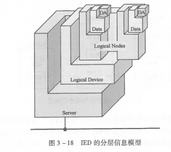

# 61850
## 技术特点
1. 信息分层
    * 站控层
    * 间隔层
    * 过程层  
    
2. 信息模型与通信协议独立  
抽象通信服务接口 ASCI。  
特定通信服务映射 SCSM 将 ACSI 映射到特定网络协议。
3. 数据自描述
4. 面向对象统一数据建模

## 模型
### 基本概念
1. 逻辑节点 LN  

2. 线路间隔的逻辑节点模型  
IED - 智能电子设备  
逻辑节点是 IED模型的基本组成组件。  
  
3. 数据和数据属性的概念  
公用数据类 CDC  
逻辑节点——数据——数据属性 <—— 树形结构  
4. 数据属性的定义  
数据属性名、数据属性类型、值/值域  
    * 功能约束 FC：分类、表征该属性能被何种服务访问/操作。
    * TrgOp = dchg(data change)：值发生变化触发报告服务
    * M/O/C：必选 M /可选 O /有条件必选 X_X_M /有条件可选 X_X_O
5. 对象名和对象引用  
逻辑节点名字：4 个大写英语字母  
6. 数据集
    * 永久性
    * 非永久性  
7. 逻辑设备  
  
  
逻辑设备可以看作包含若干**逻辑节点**和相关**通信服务**的容器。  
所有 LD 必须包含 LLNP（含有该 LD 的公共信息）和 LPHD（含有与物理装置本身相关的信息）两个逻辑节点。  
61850 将具有公用或共同特征的逻辑节点划分到一个逻辑设备中。  
国内习惯：  
    1. 公用 LD：LD0  
    装置本身信息
    2. 测量 LD：MEAS  
    装置采集的模拟量信息  
    3. 保护 LD：PROT  
    保护相关功能
    4. 控制及开入 LD：CTRL  
    装置采集的开关量状态信息和遥控信息
    5. 录波 LD：RCD  
    录波相关信息  
8. 服务器  
  
服务器描述设备「外部可视」的行为。
9. 客户端和服务器  
「客户端——服务器」/「发布方——订阅者」两种通信模式  
  

### 分层
  
  
  
